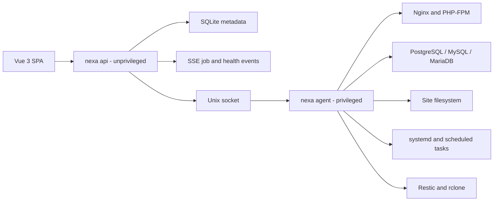

# Nexa Panel Implementation Plan

## 1. Product Vision

Nexa Panel is a **Modern Server Management Platform** for safely managing
websites, PHP runtimes, databases, domains, TLS certificates, files, logs,
scheduled jobs, and verified backups.

It is self-hosted, resource-aware, modular, and designed for both small VPS
installations and larger servers. Each user-facing feature is implemented as an
independent module inside a modular monolith, while security, jobs, audit,
secrets, and node communication remain shared platform modules.

The product should feel as approachable as cPanel while behaving like a careful
systems administrator:

- every change has a preview;
- privileged actions are typed and narrowly scoped;
- configuration is validated before activation;
- long-running actions expose progress and logs;
- failures roll back when possible;
- every administrative action is audit logged;
- backups are not considered healthy until they can be restored.

Working product name: **Nexa Panel**.

## 2. Technology Decisions

### Backend and node agent

- **Language:** Go
- **HTTP router:** `chi`
- **HTTP format:** JSON REST under `/api/v1`
- **Contract:** OpenAPI, checked into the repository
- **Database:** SQLite in WAL mode for single-node control-plane metadata
- **ORM and queries:** Bun Go ORM over `database/sql`, with module-owned models
  and query builders
- **Migrations:** append-only, versioned migrations owned by each independent
  module and recorded in the shared migration ledger
- **Logging:** Go `log/slog` with structured JSON in production
- **Metrics:** Prometheus-compatible `/metrics`
- **Container runtime:** Podman for isolated pgAdmin and optional database
  instances; phpMyAdmin reuses the native Nginx/PHP-FPM stack
- **Live updates:** Server-Sent Events initially; WebSockets only where
  bidirectional communication is required
- **Testing:** standard `testing`, `testify/require`, golden files, and
  integration tests in disposable containers/VMs

Use one Go module and one compiled binary with separate process roles:

```text
nexa api
nexa agent
nexa migrate
nexa doctor
nexa version
```

`nexa api` runs as an unprivileged `nexa` user. `nexa agent` runs as a tightly
controlled privileged systemd process. They communicate over a Unix socket in
v1. A future remote-node adapter can use mTLS without changing the control-plane
interface.

### Frontend

- **Framework:** Vue 3 with Composition API and `<script setup>`
- **Language:** TypeScript with strict mode
- **Build tool:** Vite
- **Package manager and script runner:** Bun
- **Routing:** Vue Router
- **Remote state:** TanStack Query for Vue
- **Local UI state:** Pinia, used only when state genuinely spans routes
- **Forms:** VeeValidate with valibot schemas
- **Styling:** Tailwind CSS with Nexa-owned accessible UI primitives
- **Tables:** TanStack Table for Vue
- **Code editor:** Monaco, loaded only on routes that need it
- **Testing:** Vitest, Vue Test Utils, and Playwright
- **Formatting/linting:** Prettier and ESLint

Do not duplicate server resources into large client-side stores. The backend is
the source of truth; query invalidation and server events keep the UI current.
Production Vue assets are compiled by Bun/Vite and embedded into the Go release
binary with `go:embed`. Development continues to use the Vite server for hot
reload. Production nodes do not require Bun or Node.js.

### Supported operating system

Start with **Ubuntu 24.04 LTS only**. Add Debian after the operational model is
stable. Supporting multiple distributions before installation, upgrades,
permissions, and rollback are reliable would multiply the highest-risk work.

### Resource profiles

Nexa must detect node capacity and select a profile during installation. A user
may choose a stricter profile, but cannot select one whose minimum preflight
requirements are not met.

| Profile | RAM | Intended workload | Policy |
| --- | ---: | --- | --- |
| Compact | 2 GB | A few low-traffic sites and one active database engine | Host Nginx/PHP/database, on-demand admin tools, strict limits |
| Standard | 4 GB | Several sites, one or two database instances | Optional containerized database/admin tools |
| Pro | 8 GB+ | Multiple engines/versions and heavier workloads | Parallel instances and more generous worker limits |

Two GB is a supported **compact deployment**, not an unlimited configuration.
Podman is daemonless, so the container engine itself is not the main memory
cost; the database and administration processes inside containers are. On the
compact profile:

- run Nginx and supported PHP-FPM versions on the host;
- run only one production database engine by default;
- do not keep PostgreSQL, MySQL, and MariaDB instances running simultaneously;
- serve phpMyAdmin through the existing native Nginx/PHP-FPM stack and run
  pgAdmin on demand with a session-aligned idle timeout;
- use PHP-FPM `pm = ondemand` with a node-wide child-process budget;
- apply container memory, memory-reservation, CPU, PID, and `/dev/shm` limits;
- tune database connection counts and caches from available memory;
- permit a 1-2 GB swap or zram safety layer while warning that swap is not a
  substitute for application capacity;
- serialize memory-intensive backup, restore, compression, import, and package
  operations;
- preserve a protected memory reserve for the OS, SSH, Nginx, and Nexa agent;
- refuse or require explicit acknowledgement for an operation predicted to
  exceed the safe budget.

The dashboard displays total, available, committed, and reclaimable memory plus
the estimated cost of each enabled module/instance. Capacity estimates must be
verified through integration benchmarks before publishing hard workload claims.

## 3. Scope

### Version 1

- Single managed server
- Local administrator accounts, TOTP two-factor authentication, recovery codes
- Overview and health dashboard
- Nginx site management
- Domains, subdomains, aliases, and redirects
- PHP 7.4 and all installed PHP 8.x branches through PHP-FPM
- PostgreSQL 16, 17, and 18 instances
- One host-level MySQL **or** MariaDB installation
- Database and database-user management
- Native phpMyAdmin plus Podman-managed pgAdmin with short-lived SSO
- File manager constrained to a site's filesystem
- Let's Encrypt HTTP-01 certificates and automatic renewal
- Nginx, PHP, application, and database logs
- Scheduled tasks executed as site users
- File and logical database backups
- Local storage plus one rclone remote
- Restore workflow
- Persistent job history and audit history

### Version 1.5

- Multiple MySQL and MariaDB instances using Podman
- DNS-01 certificates and wildcard domains
- S3, SFTP, Google Drive, OneDrive, and Backblaze backup presets
- Backup restore-test automation
- Notifications through email and webhooks

### Later

- Multiple remote nodes
- Teams and per-site access
- Reseller/customer model
- Resource quotas and usage accounting
- Migration/import tools
- Replication and high-availability database topologies
- Optional DNS-zone hosting

### Explicit non-goals for version 1

- Email hosting
- Billing and subscriptions
- Kubernetes
- Arbitrary root terminal in the browser
- Supporting every Linux distribution
- Clustered/HA control plane
- Editing unmanaged system configuration

## 4. System Architecture



### Modular-monolith rule

Every feature is an independent module, but modules are compiled into the same
Go binary and Vue application for v1. Independence means ownership and a stable
interface, not a separate process, database, repository, or network hop.

Feature modules:

```text
sites
domains
runtimes
databases
certificates
files
logs
schedules
backups
system
```

Shared platform modules:

```text
identity
authorization
secrets
jobs
audit
events
capacity
nodeoperator
persistence
```

Each feature module owns:

- its domain types, invariants, and authorization policies;
- its use cases and public interface;
- its HTTP route registration and OpenAPI fragments;
- its persistence queries and migration files;
- its agent operation definitions and configuration renderers;
- its Vue routes, views, forms, and query definitions;
- its unit, contract, integration, and end-to-end tests;
- its health contribution and resource/capability declaration.

Module rules:

- feature modules may depend on platform modules;
- a feature module may not query another feature module's tables directly;
- cross-module reads use the owning module's interface;
- cross-module workflows are coordinated by a dedicated workflow in the
  control-plane module rather than circular module calls;
- published events report completed facts and are not used where immediate
  consistency is required;
- disabling a module removes its routes and background work but never silently
  deletes its data;
- module migrations are versioned, ordered, and applied by the common migration
  runner;
- no runtime third-party plugin loading is required for v1;
- do not create a shallow interface merely to satisfy the module rule.

A small module descriptor registers independently compiled features:

```go
type Module interface {
	Descriptor() Descriptor
	Register(registry Registry) error
}
```

The descriptor contains identity, version, required platform capabilities,
resource-cost hints, and dependencies. The registry supplies routes, jobs,
migrations, health checks, and event registration. Business behavior remains
behind the module's own smaller interface rather than growing the descriptor.

### Process responsibilities

#### `nexa api`

- authentication, sessions, 2FA, RBAC, and CSRF protection;
- REST endpoints and OpenAPI contract;
- resource persistence and validation;
- change-plan creation and approval;
- job status, audit history, and frontend delivery;
- secret encryption/decryption only when an operation needs it;
- no direct root operations and no general-purpose shell execution.

#### `nexa agent`

- accepts authenticated, typed operations over the Unix socket;
- performs preflight checks;
- renders configuration into staging paths;
- validates, activates, reloads, and verifies configuration;
- manages packages, systemd processes, filesystem ownership, and containers;
- streams structured progress back to the control plane;
- captures rollback material before mutation;
- rejects unknown operations and arbitrary command strings.

### Filesystem layout

```text
/etc/nexa-panel/
  config.yaml
  master.key
  generated/
  rollback/

/var/lib/nexa-panel/
  control.db
  jobs/
  backup-staging/

/var/log/nexa-panel/
  api.log
  agent.log

/run/nexa-panel/
  agent.sock

/srv/nexa/sites/<site-slug>/
  public/
  private/
  logs/
  tmp/
  backups/
```

All paths must be constants owned by one configuration module. Avoid assembling
privileged paths ad hoc in HTTP handlers.

## 5. Core Domain Model

### Resources

| Resource | Purpose | Important state |
| --- | --- | --- |
| Node | A managed Linux server | health, OS, capacity, agent version |
| Site | Isolation and ownership root for a website | owner, path, runtime, status |
| Domain | Hostname routed to a site | kind, canonical target, TLS state |
| Runtime | Installed PHP version and capabilities | version, support status, extensions |
| RuntimePool | Per-site PHP-FPM execution pool | socket, limits, user, health |
| DatabaseInstance | Independent database engine process | engine, version, port, paths, health |
| Database | Logical database on an instance | name, owner, charset, size |
| DatabaseUser | Scoped database credentials | grants, expiry, rotation state |
| Certificate | TLS material for one or more domains | issuer, names, expiry, renewal state |
| ScheduledTask | User-owned recurring command | schedule, site user, timeout, status |
| BackupPlan | What, when, where, and how long to retain | source set, schedule, target, policy |
| RestorePoint | Restorable backup snapshot | manifest, checksums, verification state |
| Job | Durable execution record | operation, steps, progress, outcome |
| AuditEvent | Immutable administrative record | actor, action, target, time, result |

### Important invariants

- Each site has exactly one Unix owner and one root directory.
- A site may select only an installed runtime that is allowed by policy.
- Each PHP site has a dedicated FPM pool and Unix socket.
- Domain names are normalized and globally unique on a node.
- A database belongs to exactly one database instance.
- Every database instance has unique ports, sockets, data directories, and
  systemd/container identities.
- Secrets are never returned in list endpoints or written to job logs.
- Destructive operations require an explicit plan and recent confirmation.
- A successful configuration job includes a post-activation health check.
- A restore point is not `verified` merely because upload succeeded.

## 6. Deep Privileged-Operations Module

The main architectural seam is the interface between the control plane and the
privileged node implementation. Keep it deliberately small:

```go
type NodeOperator interface {
	Plan(ctx context.Context, change ChangeSet) (Plan, error)
	Apply(ctx context.Context, planID PlanID) (JobID, error)
	Observe(ctx context.Context, refs []ResourceRef) ([]ObservedState, error)
	Rollback(ctx context.Context, jobID JobID) (JobID, error)
}
```

The interface includes these behavioral guarantees:

- `Plan` performs read-only discovery and returns warnings, impact, steps, and
  whether interruption is expected.
- `Apply` accepts only an unexpired plan created from the current observed state.
- repeated `Apply` requests with the same idempotency key return the same job;
- `Observe` returns actual node state rather than cached desired state;
- `Rollback` is available only when rollback material was captured and remains
  valid;
- all methods return structured errors safe to display after secret redaction.

Internal adapters exist only where behavior genuinely varies:

- PostgreSQL, MySQL, and MariaDB;
- HTTP-01 and DNS-01 ACME challenges;
- local, S3, SFTP, and rclone backup destinations;
- local Unix socket and future remote mTLS transport.

Do not create a separate interface for every package. One implementation does
not justify a seam unless tests require an internal fake with meaningfully
different behavior.

## 7. Change and Job Model

### Job lifecycle

```text
queued
  -> planning
  -> running
  -> verifying
  -> succeeded

running/verifying
  -> failed
  -> rolling_back
  -> rolled_back | rollback_failed
```

Cancellation is allowed only at declared safe points. The UI must distinguish
"cancel requested" from "cancelled." A process must not be terminated during an
atomic activation or database recovery step.

### Standard configuration workflow

1. Read desired and observed state.
2. Produce a plan and human-readable diff.
3. Capture files and state required for rollback.
4. Render new configuration into staging.
5. Validate configuration.
6. Atomically activate it.
7. Gracefully reload or restart the process.
8. Perform a service and application health check.
9. Commit the new observed state or roll back.
10. Write a redacted audit event.

### Nginx example

- Generate a complete Nexa-owned site file.
- Keep advanced user directives in a separate include file.
- Run `nginx -t` before activation.
- Atomically replace the enabled configuration.
- Reload rather than restart where possible.
- Verify the intended virtual host locally using its Host header.
- Restore the prior file automatically if reload or verification fails.

## 8. Runtime and Database Strategy

### PHP

- Install supported PHP versions from a configured package repository.
- Store a capability catalog instead of hard-coding versions in frontend enums.
- Create one PHP-FPM pool per site.
- Run the pool as the site's Unix user and group.
- Use `/run/php/nexa-<site-id>.sock` with restrictive permissions.
- Support per-site process limits, memory limits, timeouts, upload limits,
  environment variables, and extension discovery.
- Treat `open_basedir` as compatibility hardening, not a security sandbox.
- Keep installed PHP 7.4 and PHP 8.x branches eligible until an administrator
  removes them; end-of-life status is a visible warning and never an automatic
  eligibility cutoff.

Runtime catalog fields:

```text
engine, version, source, installed, enabled,
support_status, security_support_until, extensions, adapter
```

### PostgreSQL

- Model PostgreSQL 16, 17, and 18 as separate instances/clusters.
- Assign each cluster a unique port, data path, socket path, log path, and
  systemd identity.
- Expose minor upgrades separately from major upgrades.
- Require an explicit migration plan for major-version upgrades.
- Start with logical per-database backup and restore.
- Add physical backup and point-in-time recovery only after WAL lifecycle and
  restore drills are implemented.

### MySQL and MariaDB

- In v1, install exactly one host engine selected during setup.
- In v1.5, manage additional versions through rootful Podman containers tied to
  systemd, persistent named data paths, health checks, and explicit ports.
- Never reuse a data directory between engines or major versions.
- Do not present MariaDB as a drop-in upgrade for an existing MySQL data path.

### Database credentials

- Generate high-entropy passwords server-side.
- Display newly generated secrets once.
- Encrypt stored credentials with envelope encryption.
- Support rotation as a first-class job.
- Scope grants to the selected database by default.
- Bind database ports to loopback unless remote access is explicitly enabled.

## 9. Database Administration SSO

phpMyAdmin and pgAdmin run as isolated web applications behind Nginx. They are
not exposed directly on public ports.

One-click launch flow:

1. Verify the panel session, role, 2FA freshness, and site/database permission.
2. Create a single-use launch token with a 30-60 second lifetime.
3. Open an admin-tool route without credentials in its URL.
4. Exchange the launch token server-side for an HttpOnly, Secure session.
5. Load only database instances permitted to that user.
6. Audit the launch and expire the token immediately.

Database passwords must never appear in URLs, HTML, local storage, browser logs,
or reverse-proxy access logs. Integrate with phpMyAdmin signon authentication and
pgAdmin webserver authentication instead of automating login-form submission.

## 10. File Manager

The file manager is a privileged file-broker interface, not a generic filesystem
browser.

Required operations:

- list, stat, preview, create, rename, copy, move, and delete;
- chunked upload and streamed download;
- create and extract supported archives;
- text editing with optimistic concurrency using an ETag/content hash;
- permission and ownership display;
- calculate directory size as a background job.

Security rules:

- every request includes a site identifier, never an arbitrary root path;
- resolve paths underneath the site's configured root;
- reject traversal, device files, unsafe symlinks, and mount escapes;
- preserve site ownership on writes;
- impose upload, archive expansion, file-count, and execution time limits;
- do not allow changing files owned by Nexa or the operating system;
- stream large files without loading them fully into Go memory.

On supported Linux kernels, evaluate `openat2` with `RESOLVE_BENEATH` and
`RESOLVE_NO_MAGICLINKS` for path confinement.

## 11. Domains and TLS

### Domain types

- primary domain;
- subdomain;
- alias/parked domain;
- redirect;
- optional `www` alias.

### Certificate lifecycle

- HTTP-01 is the v1 default.
- Check DNS resolution and ports before requesting a certificate.
- Use the ACME staging environment during testing and repeated failures.
- Store renewal state and failure reasons.
- Renew automatically before expiry and verify Nginx after deployment.
- Support certificate revocation and custom certificate upload.
- Add DNS-provider adapters for DNS-01 and wildcards in v1.5.

## 12. Scheduled Tasks

- Users configure familiar cron expressions in the UI.
- Tasks always run as a site's Unix user, never as root.
- Store commands in Nexa-owned wrapper files with controlled permissions.
- Generate `/etc/cron.d/nexa-<task-id>` entries or systemd timers through one
  scheduler implementation.
- Record start time, duration, exit status, and bounded output.
- Support timeouts, overlap prevention, manual execution, and disable/enable.
- Redact registered secrets from captured output.

## 13. Backups and Restore

### Design

Use Restic for encrypted snapshot repositories and rclone as a destination
adapter for providers such as Google Drive. Keep creation and transport as
separate job steps.

Backup pipeline:

1. Preflight free space, destination access, and credentials.
2. Create consistent logical database dumps.
3. Produce a manifest containing versions, site configuration, owners, and
   checksums.
4. Snapshot selected files, database dumps, and manifest into Restic.
5. Upload through the configured destination adapter.
6. Run repository integrity checks according to policy.
7. Apply retention only after a successful new snapshot.
8. Record exact restore instructions and verification state.

Backup state is reported independently:

```text
created -> uploaded -> integrity_checked -> restore_tested
```

### Restore workflow

- Restore into a temporary location first.
- Validate manifest, checksums, engine/runtime availability, and disk capacity.
- Let the user map domains and database names when restoring elsewhere.
- Place the site in maintenance mode for an in-place restore.
- Restore databases before activating the corresponding application files.
- Verify health, then atomically activate restored files.
- Keep pre-restore rollback material until the user-defined retention expires.

The dashboard must not label a backup healthy solely because an upload command
returned exit code zero.

## 14. Authentication, Authorization, and Audit

### Authentication

- Password hashes use Argon2id with versioned parameters.
- TOTP 2FA is required for administrators.
- Recovery codes are single-use and hashed.
- Browser sessions use Secure, HttpOnly, SameSite cookies.
- Mutating requests require CSRF protection.
- Sensitive actions require recent password/2FA confirmation.
- Login and token endpoints have rate limits and lockout protections.

### Roles

Initial roles:

- **Administrator:** system installation, updates, users, and all resources
- **Operator:** sites, databases, certificates, backups, and jobs
- **Developer:** assigned sites, files, logs, tasks, and scoped databases
- **Viewer:** read-only health, resources, and logs

Authorization is enforced in Go before plans are created, not only by hiding Vue
controls.

### Audit

Audit events include:

- actor and source address;
- action and target resource;
- plan/job identifiers;
- before/after summaries with secrets redacted;
- timestamp, result, and failure category.

Audit events are append-only through the application interface. Export and
retention are explicit administrative operations.

## 15. HTTP Interface

Representative routes:

```text
POST   /api/v1/auth/login
POST   /api/v1/auth/2fa/verify
POST   /api/v1/auth/logout
GET    /api/v1/session

GET    /api/v1/overview
GET    /api/v1/nodes
GET    /api/v1/nodes/{id}/health

GET    /api/v1/sites
POST   /api/v1/sites/plans
GET    /api/v1/sites/{id}
POST   /api/v1/sites/{id}/plans

GET    /api/v1/database-instances
POST   /api/v1/database-instances/plans
GET    /api/v1/databases
POST   /api/v1/databases/plans
POST   /api/v1/databases/{id}/admin-launch

GET    /api/v1/sites/{id}/files
POST   /api/v1/sites/{id}/files/uploads
GET    /api/v1/sites/{id}/logs/stream

GET    /api/v1/backup-plans
POST   /api/v1/backup-plans
GET    /api/v1/restore-points
POST   /api/v1/restore-points/{id}/restore-plans

GET    /api/v1/sites/{id}/ssh
POST   /api/v1/sites/{id}/ssh/enable
POST   /api/v1/sites/{id}/ssh/disable
POST   /api/v1/sites/{id}/ssh/keys
POST   /api/v1/sites/{id}/ssh/keys/generate
DELETE /api/v1/sites/{id}/ssh/keys/{keyId}
GET    /api/v1/sites/{id}/deploy-key
POST   /api/v1/sites/{id}/deploy-key
POST   /api/v1/sites/{id}/deploy-key/test
PATCH  /api/v1/sites/{id}/deployment-mode
GET    /api/v1/sites/{id}/deployment/env
PUT    /api/v1/sites/{id}/deployment/env
POST   /api/v1/sites/{id}/deployment/prepare

GET    /api/v1/plans/{id}
POST   /api/v1/plans/{id}/apply
GET    /api/v1/jobs/{id}
POST   /api/v1/jobs/{id}/cancel
GET    /api/v1/events
GET    /api/v1/audit-events
```

All mutating endpoints accept an idempotency key. Error bodies use a stable
machine-readable code, safe display message, correlation identifier, and
optional field errors.

## 16. Vue Application Structure

```text
web/
  src/
    app/
      router/
      providers/
      layouts/
    modules/
      auth/
      overview/
      sites/
      domains/
      databases/
      files/
      certificates/
      schedules/
      backups/
      jobs/
      logs/
      system/
    shared/
      api/
      ui/
      forms/
      composables/
      formatters/
      types/
```

Each frontend module owns its routes, query definitions, forms, and views. Only
genuinely reusable UI primitives belong in `shared/ui`.

### Primary routes

```text
/overview
/sites
/sites/:siteId/overview
/sites/:siteId/domains
/sites/:siteId/runtime
/sites/:siteId/files
/sites/:siteId/logs
/sites/:siteId/scheduled-tasks
/databases/instances
/databases/databases
/backups/plans
/backups/restore-points
/jobs
/system/services
/system/security
/system/audit
```

### UX standards

- Every resource page shows health, observed version/state, last change, and
  relevant recovery action.
- Destructive actions state exactly what will be deleted and whether recovery is
  available.
- Long-running operations navigate to or open a persistent job drawer.
- A plan preview shows changed files/resources and interruption risk.
- Status uses text and icons as well as color.
- Keyboard navigation and focus management are required.
- The UI meets WCAG 2.2 AA contrast and interaction expectations.
- Mobile supports monitoring and common actions; complex file/configuration work
  targets tablet and desktop.

## 17. Repository Layout

```text
nexa-panel/
  cmd/nexa/
  internal/
    platform/
      identity/
      authorization/
      secrets/
      audit/
      events/
      capacity/
      config/
      controlplane/
      nodeoperator/
      jobs/
      persistence/
      transport/
        http/
        unixsocket/
    modules/
      sites/
      domains/
      runtimes/
      databases/
      certificates/
      files/
      logs/
      schedules/
      backups/
      deploy/
      system/
    adapters/
      nginx/
      phpfpm/
      postgres/
      mysql/
      mariadb/
      podman/
      systemd/
      restic/
      rclone/
  migrations/
  openapi/
  web/
  packaging/
    systemd/
    deb/
  scripts/
  test/
    fixtures/
    integration/
  docs/
```

Keep HTTP handlers thin: decode, authorize, call a domain interface, and encode.
Do not place Nginx rendering, filesystem mutation, or database command creation
inside handlers.

The Vue `web/src/modules` directories mirror the Go feature modules so a feature
can be found, tested, enabled, or disabled without searching unrelated folders.

## 18. Testing Strategy

### Go tests

- Domain tests cover invariants and permission decisions.
- NodeOperator contract tests run against fake and real disposable adapters.
- Golden tests cover generated Nginx, PHP-FPM, systemd, and cron configuration.
- Job tests cover idempotency, cancellation safe points, crash recovery, and
  rollback failure.
- Path-confinement tests include traversal, symlinks, races, archives, and odd
  Unicode filenames.
- Secret-redaction tests scan logs, errors, audits, and serialized jobs.

### Integration tests

- Use disposable Ubuntu environments in CI.
- Install the `.deb`, run migrations, and complete initial setup.
- Provision a site and verify it through Nginx.
- Switch PHP versions and verify the served runtime.
- Create/restore databases for every supported engine adapter.
- Issue certificates against an ACME test environment.
- Back up a fixture site, destroy it, restore it, and compare behavior/data.
- Simulate invalid configuration and prove automatic rollback.
- Restart the agent during a job and prove deterministic recovery.

### Vue tests

- Unit tests for validation, permissions, status mapping, and query behavior.
- View tests for loading, empty, error, and partial-failure states.
- Playwright journeys for login/2FA, site creation, domain and TLS setup,
  database provisioning, file upload, scheduled task, backup, and restore.
- Accessibility checks on primary routes and dialogs.

## 19. Packaging and Installation

Deliver a signed Debian package containing:

- the Go binary;
- the compiled Vue assets;
- systemd definitions for API and agent roles;
- default configuration;
- migration tooling;
- a bootstrap command.

Installation flow:

1. Verify supported OS, architecture, hostname, ports, memory, and disk.
2. Install the package without silently replacing existing Nginx/database config.
3. Create system users, directories, Unix socket, and encryption key.
4. Run migrations.
5. Start the panel on a temporary local/bootstrap listener.
6. Create the first administrator and require 2FA enrollment.
7. Discover existing system services and report conflicts.
8. Configure the panel hostname and obtain TLS.
9. Disable the bootstrap flow permanently.

Upgrades must run preflight checks, back up panel metadata/configuration, apply
migrations, restart processes in dependency order, and expose a documented
rollback path.

## 20. Delivery Milestones

### Milestone 0: Foundations

- Initialize Go module and Vue 3 application.
- Add CI, linting, formatting, test harnesses, and OpenAPI generation.
- Create SQLite migration infrastructure.
- Add structured logging, correlation IDs, configuration loading, and health
  endpoints.
- Package an empty but installable `.deb` with separate API/agent systemd roles.

**Exit:** a clean Ubuntu VM can install Nexa, open the Vue shell, authenticate the
API process to the agent socket, and uninstall without leaving managed data
unless explicitly requested.

### Milestone 1: Identity, jobs, and audit tracer bullet

- Administrator bootstrap, login, sessions, TOTP, recovery codes.
- Initial RBAC middleware.
- Persistent jobs and SSE progress.
- Plan/apply interface with one safe test operation.
- Append-only audit records.

Current implementation progress:

- complete: administrator bootstrap, login, Argon2id passwords, hashed sessions,
  mandatory TOTP, encrypted seeds, replay protection, and recovery codes;
- complete: persistent single-worker job queue, restart recovery, stored progress,
  SSE replay, safe diagnostic tracer, and job UI;
- complete: append-only audit records for identity and job lifecycle actions;
- complete: viewer/operator/admin authorization policy enforced by route;
- complete: authenticated API-to-agent Unix transport and HMAC-signed,
  time-limited plan/apply/observe/rollback tracer for a fixed Nexa-owned path;
- complete: plan preview, durable execution progress, guarded rollback, and
  audit-log UI;
- pending verification: clean Ubuntu systemd smoke test of real socket group
  permissions and `/etc/nexa-panel` confinement.

**Exit:** an authenticated administrator can preview and execute a typed node
operation, watch it progress, and inspect its audit record after restart.

### Milestone 2: First complete website

- Site and Unix-user creation.
- Domain model and Nginx configuration generation.
- PHP-FPM runtime discovery and per-site pool creation.
- Atomic validation, activation, verification, and rollback.
- Site overview UI.

Current implementation progress:

- complete: project-wide Site, Domain, Runtime, Runtime Pool, Desired State, and
  Observed State language recorded in `CONTEXT.md`;
- complete: independent runtime discovery module exposes installed PHP-FPM 7.4
  and all 8.x capabilities without automatic support-date cutoffs;
- complete: Bun-backed Sites module normalizes globally unique primary domains
  and derives the Unix owner, site root, socket, and managed config paths from
  an immutable slug;
- complete: site creation queues a durable `site.plan` job and persists exact
  Nginx, per-site PHP-FPM, and starter-page artifacts in a time-limited plan;
- complete: Vue Sites page creates desired sites, selects only discovered
  runtimes, follows job progress, and previews derived paths and artifacts;
- complete: the privileged agent independently renders and HMAC-signs plans,
  captures bytes/modes/ownership and enabled-link state, provisions the Unix
  owner and confined directories, and rejects expiry, drift, or tampering;
- complete: activation uses atomic writes, validates PHP-FPM and `nginx -t`,
  reloads services, verifies the virtual host locally, and restores captured
  state plus service configuration on any failure;
- complete: the Vue plan approval, activation progress, re-planning, and guarded
  rollback workflow is connected to durable jobs.

**Exit:** create a PHP site from the UI and serve a verified page through Nginx;
an intentionally invalid change must leave the working site untouched.

### Milestone 3: Domains and TLS

- Primary domains, subdomains, aliases, and redirects.
- DNS/preflight checks.
- Let's Encrypt HTTP-01 issue, renewal, revoke, and expiry monitoring.
- Certificate UI and failure guidance.

Current implementation progress:

- complete: independent Bun-backed Domains module backfills primary domains and
  supports globally unique subdomains, aliases, and canonical redirects;
- complete: every domain change performs public DNS resolution preflight and
  generates an agent-signed full-site routing plan rather than patching Nginx;
- complete: Nginx rendering preserves ACME HTTP-01 on port 80, separates HTTP
  hostnames from certificate-covered HTTPS names, and preserves active TLS when
  later routing changes are planned;
- complete: independent Certificates module creates signed Certbot webroot
  plans for issue, renew, revoke, and reissue, blocks issuance when SAN DNS does
  not resolve, and stores issuance/expiry observations without exposing keys;
- complete: issue and renewal atomically attach the observed certificate to the
  complete Nginx site; revocation removes TLS first and restores it if Certbot
  fails; expiry monitoring flags certificates inside 30 days;
- complete: failed planning, renewal, or revocation retains previously active
  TLS paths and SAN ownership while recording operator-visible failure details;
- complete: Domains and TLS Vue modules expose plan review, DNS results, durable
  job progress, renewal/revocation preparation, expiry state, and failure
  guidance.

**Exit:** attach a domain, issue TLS, renew it in staging tests, and prove that a
failed certificate job does not break HTTP service.

### Milestone 4: PostgreSQL vertical slice

- PostgreSQL instance discovery/provisioning.
- Database and user creation, grants, rotation, import/export.
- Logical backup and restore.
- Database UI with job progress.

Current implementation progress:

- complete: independent PostgreSQL operator discovers Debian/Ubuntu clusters
  through `pg_lsclusters --json` and models versions 16, 17, and 18 with unique
  ports, data paths, sockets, logs, configuration paths, and systemd identities;
- complete: agent-signed provisioning plans verify the selected server package,
  reject observed-state drift and endpoint conflicts, create the cluster through
  `postgresql-common`, start it, and verify local readiness;
- complete: Bun-backed database roles use pending AES-GCM credentials and
  SHA-256 plan binding so plaintext never enters durable jobs, plans, arguments,
  results, or audit metadata; creation and rotation use transactional `psql`
  stdin and one-time explicit credential reveal;
- complete: logical databases use `template0`, non-superuser owners, and
  configurable connect, read-only, or read-write grants that revoke previous
  object/default privileges before applying the new access level;
- complete: custom-format `pg_dump` archives are bounded-memory hashed and
  verified with `pg_restore --list` before becoming Restore Points;
- complete: restore verifies the checksum, restores into an isolated temporary
  database, verifies it, swaps names after terminating connections, repairs a
  partial swap, and retains the original database until post-swap verification;
- complete: independent Vue Databases module covers instances, roles, one-time
  credentials, databases, grants, backup/restore planning, signed plan review,
  approval, and durable job progress;
- complete: real PostgreSQL 18 acceptance created and started a dedicated
  `postgresql-common` cluster on port 5544, parsed its live discovery payload,
  and separately created a role/database fixture, verified a custom-format
  archive, destroyed the database, restored it, and read back the original row.

**Exit:** provision a supported PostgreSQL instance and recover a destroyed test
database from a panel-created restore point.

### Milestone 5: MySQL/MariaDB and admin tools

- Select one host engine during installation.
- Database/user lifecycle and logical backup/restore.
- Native phpMyAdmin and isolated pgAdmin deployment.
- Short-lived SSO gateway and audit trail.

Current implementation progress:

- complete: a dedicated MySQL-family host operator discovers the active native
  MySQL or MariaDB server through its local Unix socket and rejects requests for
  a different engine, preserving the one-native-engine-per-host invariant;
- complete: account creation and rotation bind encrypted pending credentials to
  signed plans, pass plaintext only over agent stdin with client history
  disabled, redact failures, and refuse mutations while the general query log
  is enabled;
- complete: database-scoped connect, read-only, and read-write grants replace
  previous access without granting global privileges;
- complete: MySQL and MariaDB logical backup selects the engine-appropriate
  dump client, hashes the completed SQL artifact, and restore creates a rollback
  dump before destructive replacement and automatically imports it on failure;
- complete: the independent Bun-backed MySQL & MariaDB module owns engine,
  account, database, grant, restore-point, and signed-plan state with durable
  planning/apply jobs and one-time credential reveal;
- complete: the independent Admin Tools operator installs phpMyAdmin natively
  behind a loopback-only Nginx/PHP-FPM route and renders a root-owned pgAdmin
  Quadlet with a read-only root, no-new-privileges, all capabilities dropped,
  PID caps, a 512 MiB memory ceiling, and a 15-minute idle-stop timer;
- complete: the Bun-backed Admin Tools module discovers, deploys, starts, and
  stops phpMyAdmin and pgAdmin through reviewed signed plans and durable jobs;
- complete: Admin Tool Launch uses a 60-second single-use token, a 15-minute
  actor/tool-bound HttpOnly session, encrypted gateway state, stripped inbound
  identity headers, phpMyAdmin signon sessions, pgAdmin webserver identity and
  pgpass, and an append-only launch audit event;
- complete: independent Vue MySQL/MariaDB and Admin Tools modules expose the
  account/database/grant/restore workflows, reviewed tool plans, resource
  ceilings, and credential-free launch selectors;
- complete: real MySQL 8.4 and MariaDB 11.8 acceptance creates an account and
  database, writes data, creates a logical backup, destroys the database,
  restores it, and reads the original row through each engine-specific client;
- complete: hardened Docker-equivalent acceptance starts phpMyAdmin 5.2.3 and
  pgAdmin 9.16 with read-only roots, dropped capabilities, memory/PID ceilings,
  proves signon/webserver authentication, and verifies pgAdmin imported the
  selected server and copied its pgpass entry;
- pending: clean Ubuntu rootful hybrid admin-tool end-to-end acceptance and
  native engine package selection during installation.

**Exit:** authorized users open the correct database administration tool without
credentials appearing in browser-visible URLs or logs.

### Milestone 6: File manager, logs, and scheduled tasks

- Confined file operations, chunked transfers, editor, and archives.
- Log discovery, filters, bounded live tail, and download.
- Scheduled task lifecycle, manual run, output, timeout, and overlap protection.

Current implementation progress:

- complete: the authorization policy adds files, logs, schedules, and user
  management permissions plus a developer role limited to reading, files, logs,
  and scheduled tasks; administrators manage users, roles, password resets, and
  per-site developer grants through audited identity endpoints and a Users UI;
- complete: developer site scoping is enforced server-side — site listings are
  filtered to granted sites and ungranted site, file, log, and task requests
  return not-found without leaking existence;
- complete: a shared site-filesystem operator validates every agent request
  against the slug-derived root, owner, and path rules and confines all file
  I/O beneath the site root with kernel-enforced `os.Root` resolution
  (openat2 `RESOLVE_BENEATH` on Linux), rejecting traversal, absolute paths,
  and symlink escapes;
- complete: the file broker lists, stats, reads, writes (SHA-256 ETag
  optimistic concurrency), creates, moves, copies, and deletes only under the
  writable site zones, preserves site ownership on every write, streams
  chunked uploads through staged tmp sessions and bounded downloads through
  both HTTP hops, and runs capped archive create/extract (bomb-defended) and
  directory-size work as durable jobs with audited mutations;
- complete: the logs module discovers site log files, serves bounded filtered
  tail and incremental reads with rotation detection, streams a live tail over
  SSE with offset resume and deadline extension, and downloads logs — all
  read-only through the confined agent;
- complete: scheduled tasks render root-owned wrapper scripts and
  `/etc/cron.d` entries through HMAC-signed, drift-checked, rollback-capable
  agent plans; tasks always run as the site Unix user with `timeout`-enforced
  limits, `flock` overlap skipping, bounded captured output, and recorded run
  history; manual runs execute as durable jobs with capped timeouts;
- complete: Files, Logs, and Scheduled tasks Vue modules cover browsing,
  editing with conflict recovery, chunked upload progress, live log follow
  with scroll lock, task plan preview/apply/rollback, run-now results, and
  run history; the agent systemd unit gains `/etc/cron.d` write access and
  tmpfiles entries for the generated task-script directory;
- pending: Ubuntu end-to-end acceptance of cron execution, `runuser` manual
  runs, and Linux `openat2` confinement (developed and unit-tested on macOS
  behind injected fakes).

**Exit:** a developer role can manage only its assigned site and cannot escape
the site's filesystem or execute a scheduled task as root.

### Milestone 6.5: UI/UX uplift (frontend only)

Every module is functional but the panel does not yet feel easy to use next to
mature panels such as FastPanel: modules are silos with no cross-links, lists
have no search or state honesty, creation forms dominate pages, the mandatory
plan-approval step renders off-screen, and failures point at a Jobs page that
cannot show the failure. This milestone is Vue-only work over existing
endpoints — no new backend modules. Items marked **needs-API** require a small
additive endpoint or query parameter and must be confirmed before scheduling.

Benchmark: FastPanel's documented UX (kb.fastpanel.direct) — site-centric
navigation, one-mandatory-field creation with generated defaults, per-site
hub ("site card"), ambient health stats, credentials handed off explicitly,
and plain task language throughout.

Sequencing: A first (four later workstreams depend on the dialog primitive),
then B–D in any order; E items are independent one-offs.

#### 6.5.A Shared primitives

- `AppDialog` on native `<dialog>` (Escape, focus trap, scroll lock,
  autofocus); the missing primitive behind list-first forms, plan review,
  confirmations, and the Files destination picker.
- `AppConfirmDialog`: consequence-naming copy, danger tone, optional
  type-to-confirm (reuse the FilesView pattern).
- `ToastHost` + `useToasts`, mounted once in `App.vue`; `useJobRunner` emits
  terminal-state toasts so every module gets outcome feedback, including
  after navigating away.
- `SkeletonRow`/`SkeletonCard`, and a standard branch order in every list:
  pending → skeletons; error → danger alert naming the resource with a Retry
  button; only then empty state. An API outage must never render as "no
  databases".
- `ListToolbar` + `useCollection` composable: client-side search, filter,
  sort, and pagination over already-fetched arrays.
- `FormField` `error` prop (aria-describedby) plus invalid visual states on
  `AppInput`/`AppSelect`/`AppTextarea`; map server 4xx validation into the
  per-field slot.
- `StatusPill` plain-language tooltips from a central status→explanation map
  ("Plan ready — a reviewed change is waiting for your approval").
- `PageHeader` breadcrumbs slot; optional `to` link props on `MetricCard`,
  `FactList` items, and `ResourceRow` meta references.
- `JobProgress`: accumulated step history with timestamps, elapsed-time
  counter, `aria-live` announcements, and inline failure text with a job
  link instead of only a red bar.

#### 6.5.B Navigation and wayfinding

- Per-site hub at `/sites/:siteId`: overview facts, domains and TLS cards via
  the existing unused `listDomains(siteId)`/`listCertificates(siteId)`
  filters, relocated plan/approve actions, and shortcut tiles to
  `/files?site=`, `/logs?site=`, `/schedules?site=`. Site list rows navigate
  here; this is the FastPanel "site card" equivalent and the milestone's
  largest item.
- Global command palette (Cmd/Ctrl+K + top-bar search button): navigation
  destinations from the module registry plus cached inventories (sites,
  domains, certificates, databases) fuzzy-filtered client-side.
- Sidebar IA cleanup in module registrations: rename "Admin tools" to a
  DB-client name users will hunt for, distinct icons for Logs vs Audit,
  Overview ungrouped, groups mirroring what users own (Web hosting /
  Databases / Server / Administration).
- Wayfinding basics: per-route `document.title`, a real 404 view instead of
  the silent catch-all redirect, and TopBar stops duplicating the page title
  (freeing space for search, jobs indicator, and quick stats).
- URL-addressable selection everywhere: `?selected=` on Domains,
  Certificates, and database views (row highlight + `aria-current` +
  scroll-into-view), `?path=` in Files so refresh/back keep the working
  directory.

#### 6.5.C Task flows

- List-first layout: move every permanent create form into an `AppDialog`
  behind a primary "Create" button in `PageHeader` and empty-state actions;
  inventories become the first page content. Support `?create=1` deep links.
- `PlanReviewDialog` anchored to the triggering action (generalize the
  SchedulesView `openPlan` pattern): `PlanSteps` + facts + warnings + expiry
  countdown, Approve disabled after expiry with a "Regenerate plan" action,
  and a "Review" button on every `plan_ready` resource row (including
  grants) so abandoned plans are always recoverable. Decision: no
  auto-apply-after-planning checkbox — it bypasses the reviewed-plan
  security model.
- Inline validation before the job round-trip: auto-derive the site slug
  from the display name (editable, live pattern feedback), duplicate
  hostname checks against loaded inventory, naming-rule hints on every
  pattern-constrained field.
- Human-readable cron: client-side parse/describe with next-3-runs preview
  and real pre-submit errors; presets for every 5/15/30 minutes and twice
  daily; schedule column shows the sentence with the raw expression in a
  tooltip.
- Cross-links and next steps: site facts link to Files/Logs, certificate
  and database references link to their owners, and a success panel after
  activation offers "Upload files / Add hostname / Enable HTTPS / View
  logs"; Certificates and Domains read `?site=` to preselect.
- Files: bulk toolbar for the existing selection (delete, move, archive), a
  "Browse…" directory-picker dialog for every destination input, drag-and-
  drop upload, and in-directory name filter plus column sort.
- Users: render the developer site-scoping checklist in the create dialog
  (it exists only in edit today), add filter + select-all, list granted
  slugs in the table; add a password generator button with visibility
  toggle (also on database role/account forms); explain each role inline at
  the point of selection.
- Copy pass replacing implementation jargon with task language: "Attach
  hostname" → "Add domain", "durable failure record" → plain words, explain
  the plan-first model once in context; consequence microcopy on toggles
  and destructive buttons.
- Stretch: guided "New site" flow chaining the site → domain → certificate
  dialogs over existing endpoints, FastPanel-wizard style.

#### 6.5.D Feedback, status, and trust

- Failure diagnosability: `/jobs?job=<id>` deep links; Jobs rows expandable
  (request summary, duration, result, failure in a danger alert) with
  auto-expand + highlight from the query param; a shared `JobFailureNotice`
  ("View job #N →") replacing every plain-text "Open Jobs" string; failed
  resource rows render their stored `failure` and `lastJobId` link. Jobs
  gains state/kind filters over the fetched page (full-history queries are
  **needs-API**: server-side filter params beyond the 50-job window).
- Persistent top-bar jobs indicator: spinner + count while anything is
  queued/running, popover listing active jobs with live progress, rows
  linking to `/jobs?job=`.
- Certificates: absolute issued/expires facts with warning/danger tones,
  SAN list, default sort by soonest expiry, Overview TLS card links to the
  filtered view; per-hostname DNS preflight rows ("no records" verdict +
  "add an A record" hint) instead of "DNS checked: 3 hostnames" (a positive
  "points at this server" verdict is **needs-API**: node public IP).
- Confirmation gates via `AppConfirmDialog`: site rollback, credential
  rotate, restore approve (type the database name), certificate revoke,
  node-operation rollback.
- Credential handoff: confirm before consuming the one-time reveal, the
  revealed card names its account and connection facts, "Download .txt"
  action, visible copy failure with text auto-selected; recovery codes get
  the same download + explicit "I saved these" confirm.
- Ambient honesty: the sidebar node dot binds to the system query (green /
  warnings-amber / unreachable-rose with last-check tooltip), the
  "Development" badge derives from build mode, and the top bar gains a
  memory micro-gauge linking to `/system` (add the missing amber band to
  `ProgressBar`).
- Empty states that teach: every `EmptyState` uses its action slot ("Create
  a site →"), `AppSelect` gains an `emptyMessage` explaining how to fill it,
  disabled launch buttons say why.
- Audit legibility: severity tones by action pattern (danger for deletes,
  revokes, failed logins), actor UUIDs resolved to usernames client-side
  from `listUsers` for admins, subject expansion, render the metadata field.
- Scope the mutation busy-lock in database views to the affected form
  instead of disabling every button on the page.

#### 6.5.E Independent fixes

- `FileEditorDialog`: dirty-state guard on close, Cmd/Ctrl+S saves, save
  without closing.
- MySQL restore points: render the existing `verifiedAt` timestamp — a
  restore choice currently shows no dates.
- `AuthGate`: a way back to login from the MFA challenge/enrollment phases,
  autofocus + numeric TOTP input handling, retry on enrollment failure.
- TopBar user menu: session/role info and MFA status behind the avatar,
  sign-out moved inside (self-service password change and MFA reset are
  **needs-API**).
- Mobile drawer accessibility: Escape close, focus trap, `aria-expanded`,
  body scroll lock.
- Admin tools launch opens in a new tab instead of replacing the panel.
- Logs: keep the buffer when toggling filters while following, in-buffer
  search with match highlighting, a visible marker when the 5000-line trim
  drops output.
- ACME email defaults to the last-used value.
- Operations plan review: label artifacts beyond truncated hashes and fix
  the undefined `capitalize-first` class.

Deferred as backend-gated, acknowledged so their absence is a decision:
resource deletion lifecycle (sites, domains, databases, roles, grants),
self-service password change and MFA reset, a services start/restart table,
per-site log rotation settings, login-as-user impersonation, temporary
pre-DNS preview links, site enable/disable toggle, disk/CPU/load metrics
with interpretation bands, backups UI (Milestone 7), firewall, email, and
one-click application installs.

**Exit:** creating a site through the dialog flow ends with the plan review
in view and no resource can strand in `plan_ready` without a visible Review
affordance; every failure surface links to the failing job's detail; an API
outage renders as an error with retry, never as an empty inventory; every
destructive action names its consequence and requires confirmation; and any
managed resource is reachable from anywhere in two interactions via the
command palette or the site hub.

### Milestone 7: Remote backups and restores

- Restic repository lifecycle.
- Local destination and one rclone destination.
- Encrypted credential storage.
- Retention, integrity checks, restore planning, maintenance mode, and rollback.
- Backup/restore dashboard.

**Exit:** destroy a fixture site and database, restore both from the remote
destination on a fresh VM, and pass application verification.

### Milestone 8: Hardening and first stable release

- Threat-model review and privilege minimization.
- Package upgrade/rollback tests.
- Resource limits, rate limits, security headers, and log redaction review.
- Failure injection, disk-full behavior, interrupted jobs, and disaster recovery.
- Accessibility and performance pass.
- Administrator/operator documentation.

**Exit:** all release acceptance tests pass on a clean supported OS and an
upgrade from the prior release candidate preserves resources and audit history.

### Milestone 9: Git deployments and zero-downtime release directories

- Per-site SSH access through the site's own Unix Owner, mutually exclusive with
  that site's SFTP jail, with operator-installed authorized keys.
- Per-site ed25519 deploy keys generated on the node, with pinned GitHub host
  keys and a "Test connection" probe. Only the public half reaches the panel.
- Deployer mode: release directories, a shared path, and an atomic current-release
  symlink swap.

Current implementation progress:

- complete: SSH access (`deploy.read`/`deploy.write`, `site_ssh_access` and
  `site_ssh_keys`, enable/disable and key management with fail-closed audit);
- complete: deploy keys (`site_deploy_keys`, node-side generation, pinned
  `known_hosts`, and the `deploy.github_test` job);
- complete: deployer mode (`deployment_mode` on the site, the release tree at
  `{root}/app`, a shared path with its `.env` editor, and a seeded current-release
  symlink so the site answers before the first deploy);
- complete: node preparation (`deploy.prepare` installs the deploy tooling and
  reports, read-only, whether the firewall still admits SSH) and the narrow
  root-owned FPM reload wrapper behind a single-path sudoers drop-in;
- pending: site teardown does not yet disable SSH access or remove the deploy
  key, so `dependentBlocker` must refuse deletion while SSH access is enabled.

**Exit:** a site can be prepared, a repository cloned over its own deploy key, and
a new release activated and rolled back without dropping a request.

## 21. Release Acceptance Criteria

A release is not stable until all of the following are demonstrated:

- No HTTP-facing process runs as root.
- The privileged agent exposes no arbitrary command operation.
- A malformed Nginx or PHP configuration cannot replace the active working one.
- Every mutation creates a durable job and audit event.
- Jobs resume, fail deterministically, or roll back after process restart.
- Secrets do not appear in URLs, logs, job output, or audits; the only API
  exception is an explicit no-store one-time credential reveal.
- File-manager confinement survives traversal, symlink, and archive tests.
- Database instances cannot share ports, sockets, or data directories.
- Certificate renewal failure does not remove the existing valid certificate.
- A remote backup can restore a working site and database on a clean server.
- The installer and upgrader detect conflicts before changing the machine.
- The main Vue journeys pass keyboard and automated accessibility checks.
- A 2 GB compact-profile test server remains responsive under its documented
  workload and refuses unsafe additional instances.
- Every feature module passes its contract tests without importing another
  feature module's persistence implementation.

## 22. Highest-Risk Areas

| Risk | Mitigation |
| --- | --- |
| Root command injection | Typed agent operations, strict validation, no shell strings from HTTP |
| Filesystem escape | Site-root handles, safe path resolution, symlink/race tests |
| Invalid generated config | Staging, native validation, atomic activation, health check, rollback |
| Database-version collisions | First-class instances with unique identities and paths |
| Backup that cannot restore | Manifest, integrity checks, automated restore drills |
| Credential exposure through admin tools | Server-side exchange tokens, HttpOnly cookies, log redaction |
| Package upgrades damage existing server | One supported OS, discovery, preflight diff, backups, rollback |
| Scope becomes a full cPanel clone too early | Enforce v1 non-goals and vertical-slice milestones |
| Two GB node becomes unresponsive | Compact profile, protected reserve, on-demand tools, cgroup limits, admission checks |
| "Independent modules" become microservices or wrappers | Modular monolith, ownership rules, deep interfaces, contract tests |

## 23. First Engineering Issues

1. Initialize the Go module, Vue workspace, CI, linting, and test commands.
2. Define the OpenAPI error envelope, authentication endpoints, and generated
   TypeScript client workflow.
3. Create configuration, SQLite migration, and encrypted-secret modules.
4. Implement API-to-agent Unix-socket authentication and request framing.
5. Implement persistent jobs, job steps, SSE updates, and restart recovery.
6. Implement audit events and central secret-redaction tests.
7. Build the Vue application shell, login/2FA flow, navigation, and job drawer.
8. Implement the NodeOperator plan/apply/observe/rollback tracer bullet.
9. Package the two process roles as systemd units in an installable `.deb`.
10. Begin the first website vertical slice only after the tracer bullet passes on
    a clean Ubuntu VM.

## 24. References

- [PHP supported versions](https://www.php.net/supported-versions.php)
- [PostgreSQL versioning policy](https://www.postgresql.org/support/versioning/)
- [MySQL multiple-instance documentation](https://dev.mysql.com/doc/refman/8.4/en/multiple-servers.html)
- [MariaDB multiple-instance documentation](https://mariadb.com/docs/server/server-management/starting-and-stopping-mariadb/running-multiple-mariadb-server-processes)
- [Nginx command-line validation](https://nginx.org/en/docs/switches.html)
- [pgAdmin webserver authentication](https://www.pgadmin.org/docs/pgadmin4/latest/webserver.html)
- [rclone Google Drive backend](https://rclone.org/drive/)
- [Restic rclone backend](https://restic.readthedocs.io/en/stable/030_preparing_a_new_repo.html)
- [Podman documentation](https://docs.podman.io/en/stable/index.html)
- [Podman container resource limits](https://docs.podman.io/en/latest/markdown/podman-create.1.html)
